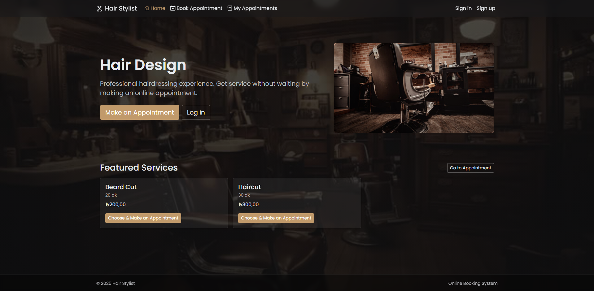

# Hair Stylist Online Appointment System

An ASP.NET Core MVC project developed as a portfolio piece.  
Allows customers to book, view, and cancel appointments online.  
Admins can manage services and appointments.

## 📸 Screenshots

### 🏠 Home Page

### 🔑 Login Page

### 📝 Register Page

### 📅 Book Appointment

### 📖 My Appointments

### ⚙️ Admin Dashboard

## Features
- User authentication (ASP.NET Identity)
- Book / cancel appointments
- Service management (Admin)
- Calendar integration (FullCalendar)
- Bootstrap 5 responsive UI

## Tech Stack
- ASP.NET Core 8 MVC
- Entity Framework Core (Code First)
- SQL Server LocalDB
- Identity for auth
- Bootstrap 5, FullCalendar.js

## Setup
1. Clone the repo
2. Update **appsettings.json** with your SQL Server connection string
3. Run `update-database`
4. Run the project with `dotnet run`

## Default Admin
- Email: (see `appsettings.json:Seed:AdminEmail`)
- Password: set during seeding
